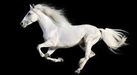

# Caballo

 **Mamífero** solípedo del orden de los perisodáctilos, de tamaño grande y extremidades largas, cuello y cola poblados de cerdas largas y abundantes, que se domestica fácilmente y suele utilizarse como montura o animal de tiro.