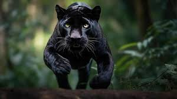

# Pantera

La **pantera negra** es una variación melanica de varias especies de grandes félidos, en especial del leopardo (Panthera pardus) y del jaguar (Panthera onca). No es una nueva especie, ni siquiera una subespecie, es simplemente una variación negra de estos animales.